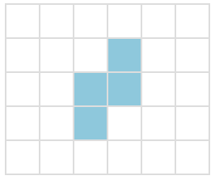
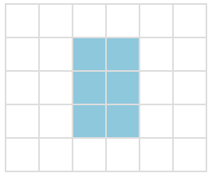
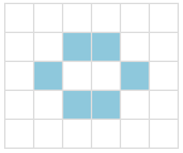
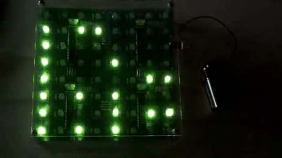
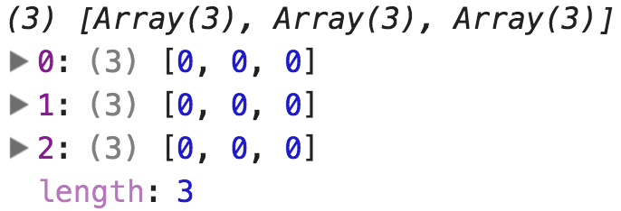
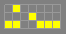

# Conway's game of life

We are going to program a JavaScript version of the Game of Life. Along the way, we'll continue learning and practicing DOM manipulation, Event Handlers and more.

## What is the Game of Life?

[Conway's Game of Life](https://en.wikipedia.org/wiki/Conway's_Game_of_Life) is a set of rules governing the destruction, persistence, or propagation of neighboring cells in a grid — a pseudo-simulation of life. It was created by John Horton Conway in 1970, in an effort to simplify a concept by the mathematician John von Neumann in the 1940s. The intent and power of the game is not in realistically simulating life, but rather in serving as a simple system that produces complex behavior. In fact, the Game of Life is a [universal Turing machine](http://en.wikipedia.org/wiki/Turing_machine), capable of modeling any algorithmic calculation.

Here is an [example video](http://www.youtube.com/watch?v=C2vgICfQawE) showing many of the complex patterns that the Game of Life can produce.

---

## How to play the game?

The game of life is played on a 2D board (easily modeled as a 2D array), where each cell has two possible states: _living_ or _dead_. For each iteration of the board state, the destiny of each cell is determined by these four rules:

1. Any live cell with two or three live neighbors lives on to the next generation.
2. Any live cell with fewer than two live neighbors dies, as if caused by under-population.
3. Any live cell with more than three live neighbors dies, as if by overcrowding.
4. Any dead cell with exactly three live neighbors becomes a live cell, as if by reproduction.

The initial pattern constitutes the seed of the system. The first generation is created by applying the above rules simultaneously to every cell in the seed — in other words, each generation is a pure function of the preceding one. The discrete moment at which all the births and deaths actually occur is often called a step. The rules are applied repeatedly to create further generations (one new generation per step).

---

## LET'S LOOK AT HOW AN EXAMPLE GOL BOARD COULD EVOLVE

**_Step 1_** 

**_Step 2_** 

**_Step 3_** 

Step 3 is a stable state.

---

## Setup

We've setup an [initial project on Github](https://github.com/TEJ-Fellowship/game-of-life) for you to fork.

## Your finished work could look something like [this](https://tej-fellowship.github.io/game-of-life.solution/)

## Development approach

This specific page is not a hands-on, actionable exercise - just read it, you won't have to type anything.

We will start by discussing how to aproach the development of the Game of Life project, beginning by understanding what is already provided and how to expand from that:

### Project Skeleton

A project skeleton has been provided, complete with an HTML and CSS files. There are two JavaScript files: `GameOfLife.js` and `main.js`.

Let's start by taking a look at `GameOfLife.js`:

---

## GameOfLife.js

The `GameOfLife.js` file contains a `GameOfLife` `class`. This class will build a 2D Array to represent the board of cells. Each cell is just a value (a boolean or an integer - 0 and 1 for example) representing whether it's alive or dead. Something like this:

```js
[
  [0, 0, 1, 1, 1, 1, 0, 0],
  [0, 1, 0, 0, 0, 0, 1, 0],
  [1, 0, 1, 0, 0, 1, 0, 1],
  [1, 0, 0, 0, 0, 0, 0, 1],
  [1, 0, 1, 0, 0, 1, 0, 1],
  [1, 0, 0, 1, 1, 0, 0, 1],
  [0, 1, 0, 0, 0, 0, 1, 0],
  [0, 0, 1, 1, 1, 1, 0, 0],
];
```

Now, you might be wondering - Why not use `DOM` elements as cells instead of an `array`? Well, using a plain array and having the game rules operate on that array means that the GameOfLife class will be portable - when running on the browser we will have freedom to choose how to display the board of cells to the user - Manipulating the DOM to build a table or using a Canvas element, for example. But it doesn't stop there, because the class could also run on the server or even on a physical computing platform, making game of life display on a LED matrix:



---

## main.js

The main.js file glues together the GameOfLife class and the DOM, being responsible for:

- creating an instance of GameOfLife
- Looping over the cells and representing them in the DOM (so the user can see them).
- Handling buttons and calling GameOfLife instance methods: toggling cells; starting & stopping the game and also clearing or randomizing the board.

---

## What is provided?

### `GameOfLife.js`

This is the provided in the `GameOfLife.js` file, take a look:

```js
class GameOfLife {
  constructor(width, height) {
    this.width = width;
    this.height = height;
    this.board = this.makeBoard();
  }

  makeBoard() {}

  livingNeighbors(row, col) {}

  tick() {
    const newBoard = this.makeBoard();
    // TODO
    this.board = newBoard;
  }
}
```

Here, we stripped a few comments that you will find in the real, provided GameOfLife.js file, but it is essentially the same. Notice that there are four methods given: A `constructor`, `makeBoard`, `livingNeighbors` and `tick`.

This is the bare minimun amount of methods to make this work: In the `constructor` we set the `width` and `height` of the board and create a new board by invoking `this.makeBoard()`.

At the bottom, the `tick` function is responsible for producing the next iteration of the game. First, it makes a new board of cells. Then, it should loop over each cell in the current board, count it's `livingNeighbors` and, based on the `Game of life` rules, change the cells in the `newBoard` to their future status.

Also notice that these suggested methods are the absolute bare minimum you will need - feel free to add as many new methods as you find necessary during development to keep your code organized. Some examples of functions many students usually end up adding include `getCell`, `setCell` and `toggleCell`.

On the next section, let's get started by the `makeBoard` function.

---

## Making the board

### `makeBoard()`

Now it's time to start coding - Your first step is to be able to generate the `2D array` representing the board. Take a look at the comments in the provided `makeBoard` function for guidance and put your hands to work.

---

## How to test if i did it right?

Open the `index.html` file in the browser. Since the GameOfLife class is in global scope, you can open the developer console and create a new instance:

```js
let game = new GameOfLife(3, 3);
```

From this point you can just log `game.board`. If your board generation is correct, you should see something like this:



---

## Utility methods

This is a suggestion: Before getting to the `livingNeighbors` and `tick` methods, you might want to consider creating a few utility methods so you can safely manipulate the 2D array representing the board from other methods. Some suggested methods:

- `getCell(row, col)` - Returns the cell value for the given row and col coordinates. You might be asking yourself why is this any better than simply going directly to the array (like in `board[row][col]...`). Well, if you're operating directly in the array and provide an invalid value for row, something like `board[-1][0]`, this will throw an error. By creating an utility function you can check if the provided coordinate values are valid before operating in the board array, and return dead as the default value (in case the given coordinates are not valid).
- `setCell(value, row, col)` - Sets a new value for a cell in the given `row` and `col` coordinates. Similarly to `getCell`, this method can provide safety to your program by checking whether the coordinates are valid within the board Array before setting the actual value.
- `toggleCell(row, col)` - toggle a cell value between `dead` and `alive`.

Again, these are suggestions: Feel free to do all of them, none of them, or just keep them in mind and skip for now, returning to them as needed.

---

## Evolving the board

Now it's time to make the game happen: Producing a new evolution of the board based on the current cells.

This should happen when the `tick` method is called, but the implementation will be up to you: In general, these are the steps you will have to take to make it work:

1. Create a blank new board - something like `const newBoard = this.makeBoard()`. We will use this new board as the base for the next generation of cells.
2. Loop through every cell on the board: For each cell on the current board you will want to:
   1. Check how many alive neighbors this cell has (maybe use the `livingNeighbors` function to help on this?).
   2. Apply the game rules for the given state of this cell and the number of living neighbors (See rules below).
   3. Set, on the new board, whether this cell will be `alive` or `dead` on the next generation.
3. After looping though all the cells and producing a new board that represents the next generation, change `this.board` to point to the newly created board.

### Conway's rules

- Any live cell with fewer than two live neighbours dies (as if caused by underpopulation).
- Any live cell with more than three live neighbours dies (as if by overpopulation).
- Any dead cell with exactly three live neighbours becomes a live cell (as if by reproduction).

### How to test?

Since we're not connecting the `GameOfLife` `class` to the DOM yet, there is no visualization for your board. In order to test whether your `tick` implementation is working you're going to have to write some code.

---

## AUTOMATED TESTING

Manually checking the behaviour of the `GameOfLife` `class` can get tedious pretty quickly. If you prefer, you can setup `Testem` and write a spec file for the `GameOfLife` `class`. This takes more time to setup, but the benefits quickly pay of. If you want to take some effort upfront to make automated tests, check the guide:

<details><summary>Hint: setting up automated tests for GameOfLife</summary>

We will use `Testem` to run specs for the `GameOfLife` class. `Testem` is a test runner - it will look for all JavaScript and spec files in the folder and run them - showing you a nice interface to see the test results in the browser.
We used `Testem` before, so you probably have it installed already. In any case, you can install with a simple:

```
npm install testem
```

Next, create a spec file for your `GameofLife` class. You can call it "GameOfLifeSpec.js". Here are a few provided tests to get you going - they test if:

- The class creates a board of a specified size
- If the `livingNeighbors` function is counting properly
- If the `tick` function properly creates a new generation of cells according do `Conway's rules`

```js
describe("new GameOfLife", function () {
  it("creates a board of a specified size", function () {
    const game = new GameOfLife(3, 4);
    expect(game.width).toEqual(3);
    expect(game.height).toEqual(4);
    expect(game.board).toEqual([
      [0, 0, 0],
      [0, 0, 0],
      [0, 0, 0],
      [0, 0, 0],
    ]);
  });
});

describe("Board::livingNeighbors(row, col)", function () {
  it("doesn't include the cell itself", function () {
    const game = new GameOfLife(3, 3);
    // Let's force our own board to test livingNeighbors
    game.board = [
      [1, 1, 1],
      [1, 1, 1],
      [1, 1, 1],
    ];
    expect(game.livingNeighbors(1, 1)).toEqual(8);
  });

  it("counts only living cells", function () {
    const game = new GameOfLife(3, 3);
    game.board = [
      [1, 1, 1],
      [1, 1, 1],
      [0, 0, 0],
    ];
    expect(game.livingNeighbors(1, 1)).toEqual(5);
  });
});

describe("tick()", function () {
  it("advances a blinker from gen1 to gen2", function () {
    const game = new GameOfLife(3, 3);
    const blinker1 = [
      [0, 1, 0],
      [0, 1, 0],
      [0, 1, 0],
    ];
    const blinker2 = [
      [0, 0, 0],
      [1, 1, 1],
      [0, 0, 0],
    ];
    game.board = blinker1;
    game.tick();
    expect(game.board).toEqual(blinker2);
  });

  it("advances a glider from gen1 to gen2", function () {
    const game = new GameOfLife(3, 3);
    const glider1 = [
      [1, 0, 1],
      [0, 1, 1],
      [0, 1, 0],
    ];
    const glider2 = [
      [0, 0, 1],
      [1, 0, 1],
      [0, 1, 1],
    ];
    game.board = glider1;
    game.tick();
    expect(game.board).toEqual(glider2);
  });
});
```

</details>

---

## Manual testing

A simple case would be setting the board with a blinker - three consecutive alive cells with no other living neighbors. If rules are applied correctly, it should oscillate between horizontal and vertical:


Here's the code:

```js
const game = new GameOfLife(3, 3);

game.board[1][0] = 1; // or true, depending on which value represents "alive" in your implementation.
game.board[1][1] = 1;
game.board[1][2] = 1;

console.log(game.board);
//  [
//   [0, 0, 0],
//   [1, 1, 1],
//   [0, 0, 0]
//  ]

game.tick();

console.log(game.board);
//  [
//   [0, 1, 0],
//   [0, 1, 0],
//   [0, 1, 0]
//  ]
```

---

## Game elements

If you reached this point, your `GameOfLife` class should be capable of creating a new board of cells and producing new generations of cells based on Conway's Game of Life rules.

But, nothing is visible to the end user - everything happens in memory... Now it's time to connect your class to the DOM, making a visual representation of your alive and dead cells and providing a few buttons to play, clear and perform a few other actions.

All of these will be coded in the `main.js` file, but before we dive into the code details, let's first understand the user interface and which interactions they can make:

### A Board

The central piece of the interface is an HTML `<table>` representing the board and cells. This table is dynamically generated with JavaScript in the `main.js` file and you will learn more about it in the next page.

### Control Panel

You should have a control panel that has five buttons:

- Step
- Auto-Play
- Pause
- Reset Random
- Clear

### Initial Position of Board

The board will need an initial position before the game starts. The user should be able to set this initial position in two ways:

- Random - The user clicks in the "Reset Random" to produce a set of random alive and dead cells.
- Manual - make each table cell in your HTML table click-able so the user can toggle between alive and dead and produce the desired initial position.

---

## What is provided?

`main.js`
Let's take a look on what's already provided in `main.js`:

to begin with, two arbitrary constants are defined: `width` and `height`. In sequence, a new `GameOfLife` instance is created.

```js
const width = 25;
const height = 20;

/**
 * Create a Game of Life instance
 */

const gol = new GameOfLife(width, height);
```

Continuing with the source code, this next section creates a new `<table>` element with the same `width` and `height`.

There are three important things to notice in this code:

1. There is an array call `tds` in which all `<td>` elements (the actual table cells) are pushed into. This will be useful in the future to loop through all cells in the table.

2. Also regarding `<td>` elements: We're using dataset to store the `row` and `col` information in the element itself. This information can be later retrieved using the same syntax.

3. Finally, the whole table, with all rows and cells, is appended to the DOM.

```js
// Actual table cells
const tds = [];

// <table> element
const table = document.createElement("tbody");
// build a table row <tr>
for (let h = 0; h < height; h++) {
  const tr = document.createElement("tr");
  // build a table column <td>
  for (let w = 0; w < width; w++) {
    const td = document.createElement("td");
    // We'll put the coordinates on the cell
    // Element itself (using dataset),
    // letting us fetch it in a click listener later.
    td.dataset.row = h;
    td.dataset.col = w;
    tds.push(td);
    tr.append(td);
  }
  table.append(tr);
}
document.getElementById("board").append(table);
```

Finally, an empty `paint` function is provided, as well as empty event listeners for the board and all four buttons:

```js
const paint = () => {};

document.getElementById("board").addEventListener("click", (event) => {});
document.getElementById("step_btn").addEventListener("click", (event) => {});
document.getElementById("play_btn").addEventListener("click", (event) => {});
document.getElementById("random_btn").addEventListener("click", (event) => {});
document.getElementById("clear_btn").addEventListener("click", (event) => {});
```

---

## Gameplay

Now that you understand the code provided in `main.js`, it's time to add your own code:

### paint

This function takes whatever is the current board in the `GameOfLife` instance and adjusts the DOM to match it.

You can take a few approaches to this. You might find all the `<td>` elements under the `<table>`, and ensure that they have the alive class if and only if their coord is alive in the present.

Querying for all the `<td>`s is kind of expensive though. That's why the current code holds onto them in an array when the table is created.

There are other approaches, of course.

### board Click

Once the board is generated, you need to allow the user to set an initial configuration of the board. This will have to be done using "click" event on the board itself, but discerning which specific cell was clicked with `event.target`.

Once you know the coordinates of the clicked cell, you can toggle it's status in the `gol GameOfLife` intance and call `paint` to update the DOM representation.

### step

The game must evolve, visually, step by step. The `Step` button event handler function should call `tick`, and paint the DOM again with the new board.

### play

Once you have a `step` function, it should be easy to write the `enableAutoPlay` function that automates the game by playing a step at various time intervals, such as 100ms, 200ms, etc. `setInterval` should be very useful to you here.

### TIPS

If you are using an interval to create an autoplay, ensure that multiple clicks of the autoplay button does not instantiate multiple interval objects.

Also, be careful with what your `this` might be! Remember that `this` is set by the invocation of a function, not its definition. In other words, just because your `this` was correct in your step function earlier, it may be different if the function is being called in a different way.

### clear and random

Both button implementations are similar: Loop through each cell in the board.

- Clearing: forEachCell --> set cell to dead
- Randomizing: forEachCell --> a chance that cell is set to dead, another chance cell is set to alive

Don't forget to call `paint` after clearing or randomizing the board

---

# Bonus

## Make a shape loader

How many interesting "starting positions" were you able to come up with?

Turns out that there are tons of really cool starting positions that others have developed and shared with us. One large resource of these is [this website](http://www.bitstorm.org/gameoflife/lexicon/). Different starting positions are available to download in the `.cells` files, where dots represent "dead cells" and 0's represent alive cells.

For example, the Acorn pattern: is described in a file [acorn.cells](http://www.bitstorm.org/gameoflife/lexicon/cells/acorn.cells) as:

```
!Name: acorn
!
.O.....
...O...
OO..OOO
```

You can also check out the GOL wiki [here](http://conwaylife.com/wiki/Main_Page) and download hundreds of known pattern files as a zip.

### Your Task

1. Download some interesting looking `.cells` files, and load them into your app as JS strings (note that you can open the `.cells` file in VSCode, just like any other text file). You can load your `.cells` file content to your JS manually for now (meaning manually copy-paste patterns into your code, maybe as an array of starting patterns?).
2. Add an upload button.
3. Wire it up to a function that reads an uploaded starting pattern into your app so you can play them in your Game of Life engine.

Check out the first couple sections of the Mozilla docs' [guide on working with file inputs](https://developer.mozilla.org/en-US/docs/Using_files_from_web_applications). Also, you'll find that the [FileReader API](https://developer.mozilla.org/en-US/docs/Web/API/FileReader) is essential here.

## Conclusion

This workshop is a classic exercise in writing game logic and combining it with DOM manipulation, particularly event listeners, to create a user interface. Keys to success when creating your Game of Life included writing utility functions to keep your code DRY; using an object literal namespacing pattern for more readable and extensible code; and the careful application of event listeners (and `this`) to update DOM elements. On top of that, you had even more practice with vanilla Javascript DOM manipulation and functional programming.

### Main Takeaways

- Conway's Game of Life is one example of a cellular automaton. It has a particular set of rules that govern the state of each cell in a grid, depending on the state of its neighbors.
- In order to to write logic to control this particular game play, you must first capture the game state of each cell, and then update them.
- Event listeners/click handlers help to create an interactive user interface, but pay close attention to the value of `this` when using them.
- Using object literal namespacing will help you maintain a pristine global scope, and result in more readable and extensible code; again, though, pay close attention when using `this`.
- In general, you should aim for DRY and well-organized code.

## Additional reading

- [Cellular Automaton](http://mathworld.wolfram.com/CellularAutomaton.html) (MathWorld)
